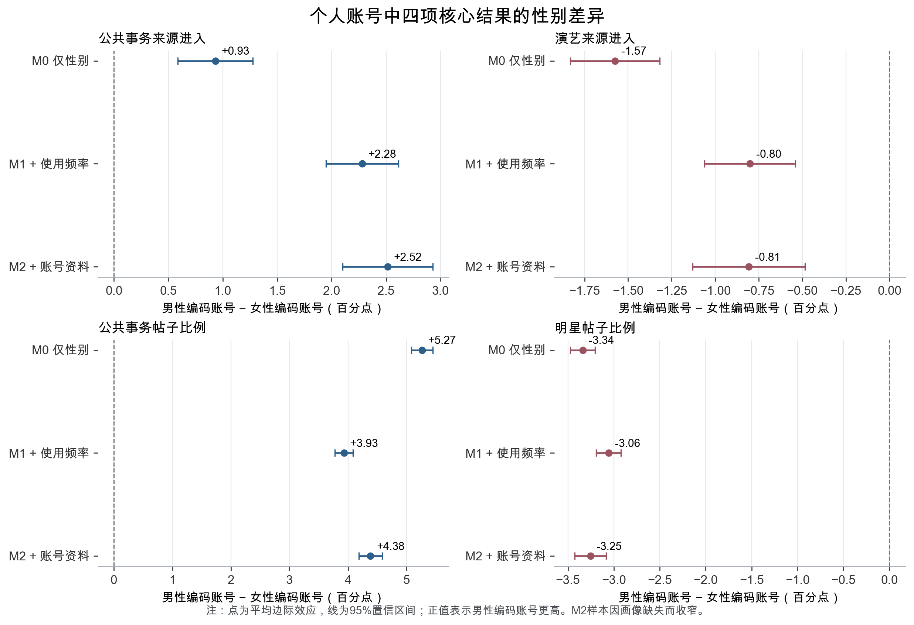
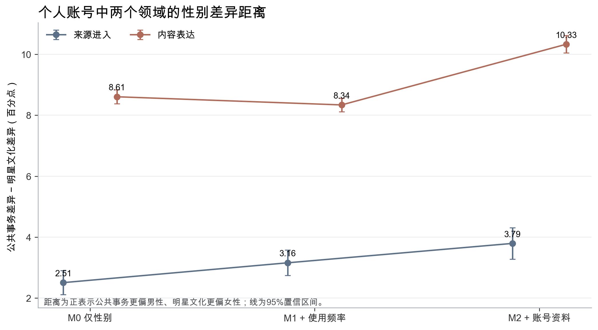
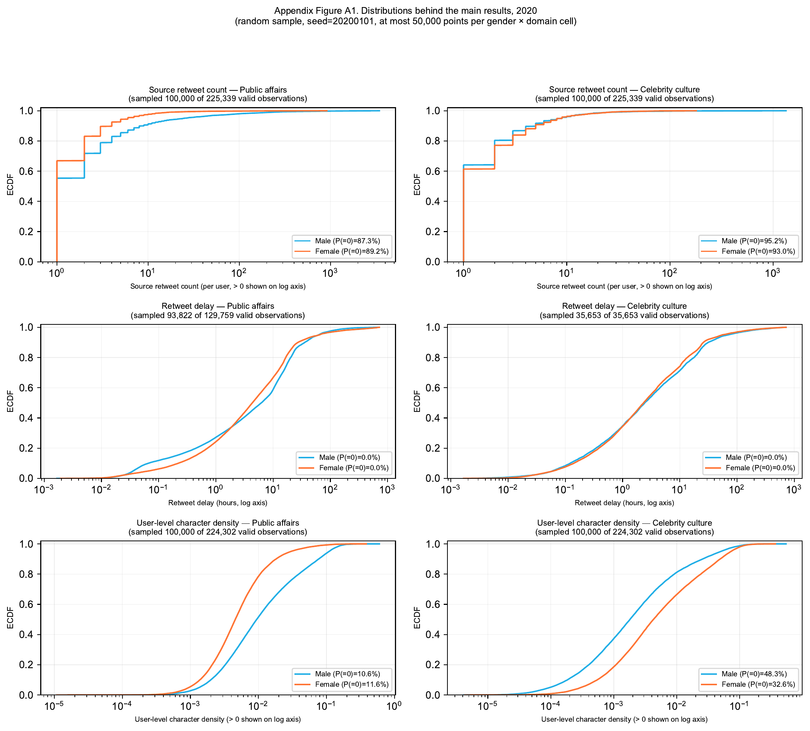
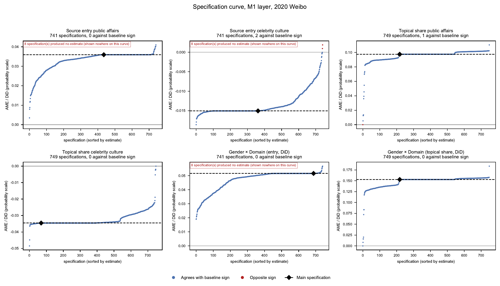
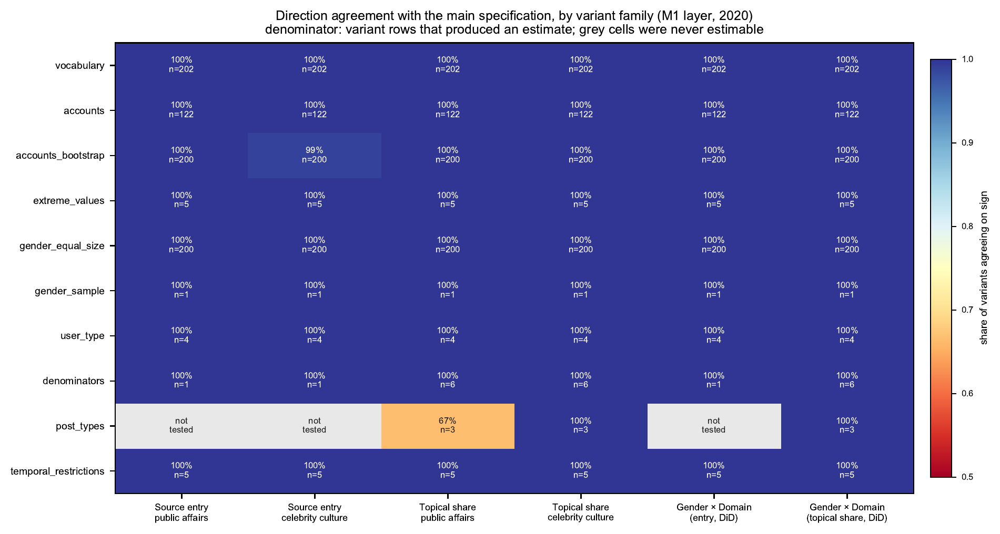
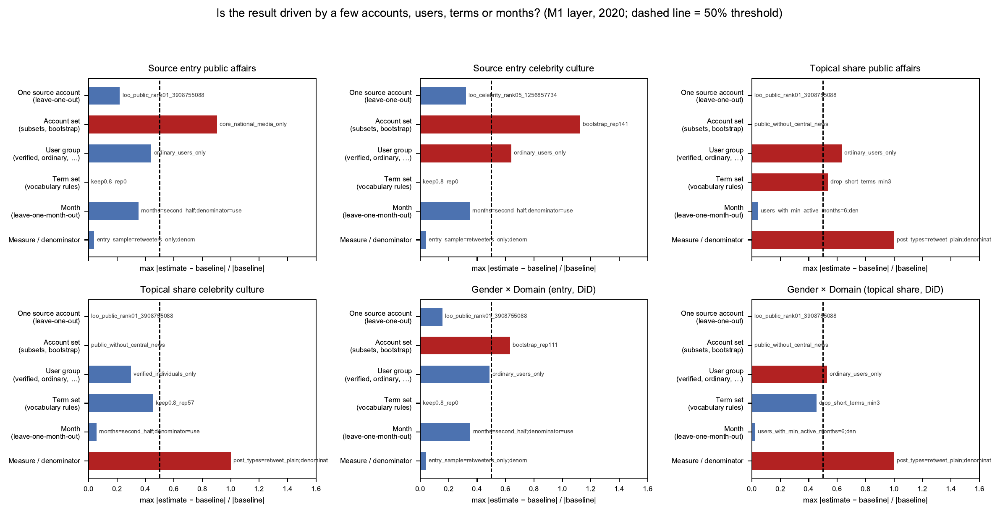
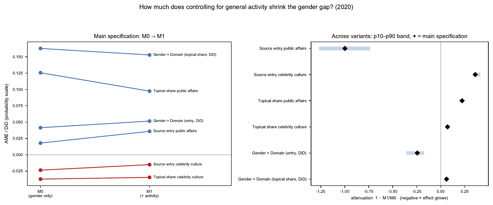
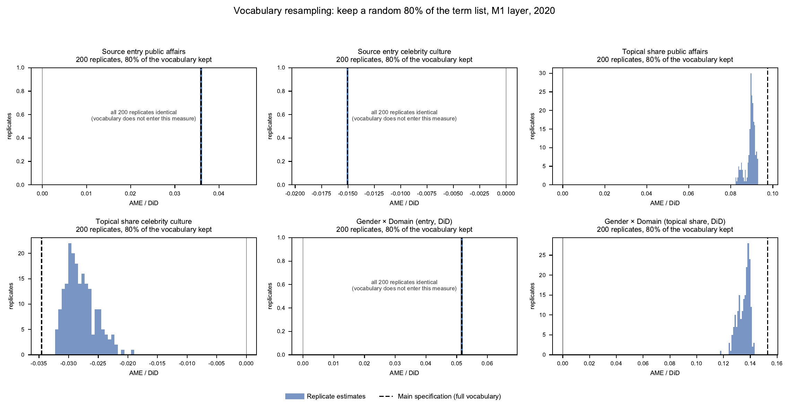
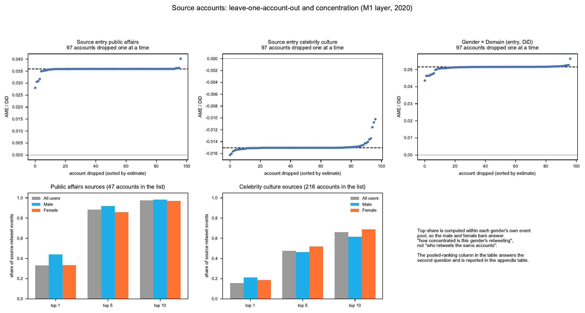
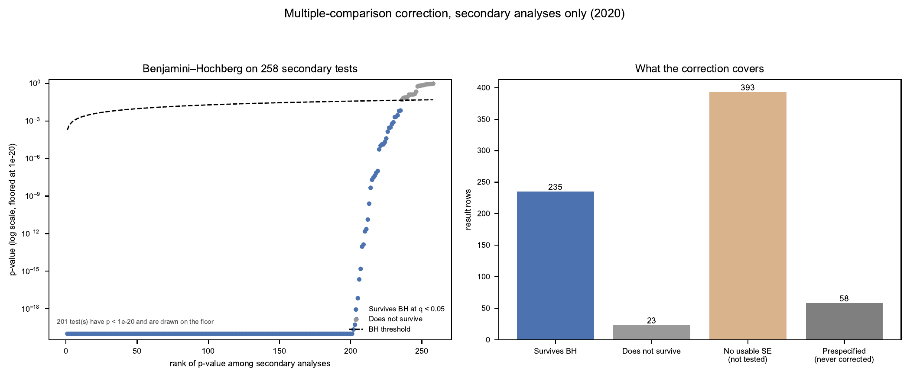

# 性别化的信息领域参与:微博账号的公共事务与明星文化传播和表达

## 摘要

数字不平等研究长期关注男性和女性能否获得互联网接入及基本使用条件。随着互联网日益普及，性别差异逐渐从是否接入互联网延伸到以何种方式参与互联网。针对这一问题，本文使用2020年微博225,339个账号及其146,811,818条帖子，分析不同性别账号在公共事务领域和明星文化领域的信息消费与内容表达特征。研究结果显示，在发帖量、转发量和活跃时间相近的账号中，男性账号参与公共事务信息消费的平均概率为14.15%，显著高于女性账号的10.52%；女性账号参与明星文化信息消费的平均概率为6.93%，显著高于男性账号的5.40%。在内容表达方面，男性账号发布的公共事务内容比例约为女性账号的2.36倍，女性账号发布的明星文化内容比例约为男性账号的2.27倍，两项差异均达到统计显著水平。稳健性分析表明，上述结果并未受到个人账号筛选、男女样本数量不平衡、极端值处理、观察月份、来源账号选择或词表构造的实质影响。研究表明，网络普及之后的数字性别差异同时体现于参与领域和参与方式：男性账号相对偏向公共事务领域，女性账号相对偏向明星文化领域。

**关键词：**社交媒体；信息领域参与；性别差异

## 一、引言

数字不平等研究早期主要考察不同群体能否接入互联网，以及是否具备基本的设备和连接条件。随着互联网渗透率提高，接入差异逐渐缩小，研究重心转向数字技能、使用方式和使用收益（DiMaggio和Hargittai，2001；Hargittai，2002；van Deursen和van Dijk，2014）。这意味着，判断不同群体是否处于平等的数字环境，不能只看他们能否上网，还要考察他们如何使用网络、获得何种信息以及能否把数字资源转化为实际收益。社交媒体进一步拓展了这一问题。公共政策、社会事件、明星动态、文化产品和日常交往持续出现在同一信息流中，用户既可以浏览和转发既有信息，也可以评论和发布内容。平台提供了共同入口，却同时形成了高度分化的信息选择，使数字性别差异可能表现为不同群体进入哪些信息领域，以及以何种方式参与这些领域。

这种分化在公共事务与明星文化之间尤其值得关注。政治兴趣、新闻使用和政治参与研究长期发现男女差异，但差异幅度会随议题范围和参与形式变化（Verba、Burns和Schlozman，1997；Coffé，2013；Ferrín等，2020）。当地方事务、社会政策和日常生活议题进入测量时，传统政治兴趣指标中的性别差距往往缩小。与此同时，高选择媒介环境使新闻与娱乐偏好成为组织信息消费的重要力量（Prior，2005；Strömbäck、Djerf-Pierre和Shehata，2013）。在中国社交媒体上，明星文化也形成了由转发、评论、内容生产和平台指标共同维持的参与体系（Yin，2020；Zhang和Negus，2020；He和Li，2023）。公共事务与明星文化由此构成两个具有不同社会意义、又同时存在于同一平台的信息领域。进一步说，转发某类来源与公开谈论某类议题也不是同一种行为，前者留下信息消费和传播的痕迹，后者使议题进入账号的公开表达，两种参与方式面对的表达成本、受众判断和社会评价并不相同（Bode，2017；Koc-Michalska等，2021）。

本文由此关注一个核心问题：网络接入日益普及之后，不同性别账号在公共事务领域和明星文化领域的信息消费与内容表达呈现出怎样的差异？为回答这一问题，本文构建由两个信息领域和两种参与方式组成的研究框架。两个信息领域分别是以社会热点、公共政策和社会事件为中心的公共事务领域，以及以演员、歌手等演艺明星为中心的明星文化领域；两种参与方式分别是通过转发特定领域来源进入信息传播链条的信息消费，以及在公开文字帖中谈论相关议题的内容表达。本文使用2020年微博225,339个账号及其146,811,818条帖子，在同一批账号和同一观察期内形成四项相互对应的测量，进而比较不同性别账号在两个信息领域和两种参与方式中的参与特征。

## 二、文献回顾与分析框架

### （一）数字不平等中的性别差异：从接入到使用

数字鸿沟研究最初主要用设备拥有和网络接入识别不平等。随着互联网普及，研究者开始强调接入之后的差异，包括使用自主性、数字技能、使用目的和由网络使用获得的收益（DiMaggio和Hargittai，2001；Hargittai，2002；van Deursen和van Dijk，2014）。Scheerder、van Deursen和van Dijk（2017）的系统综述进一步将这一变化概括为第二层次和第三层次数字鸿沟：前者关注技能和使用差异，后者关注不同使用能否转化为社会、文化、经济和政治收益。这一研究进展意味着，共同接入互联网只提供了相似的技术起点，不能据此推断不同群体拥有相同的数字实践及其结果。

性别差异也沿着这一脉络发生变化。早期研究主要讨论女性较低的互联网使用率及其社会经济来源（Bimber，2000），后续研究则发现，男女在实际网络技能、自我评价和具体使用上的差异并不完全一致。Hargittai和Shafer（2006）发现，女性对自身网络技能的评价低于男性，但实际操作能力并没有出现同等幅度的差异。Helsper（2010）进一步指出，性别差异会随生命阶段、就业和家庭状况发生变化，不同网络用途中的差异也并不一致。因此，网络普及并没有使数字性别不平等自动消失，而是使差异更可能表现为技能评价、使用安排和参与方向的组合。

社交媒体使这种接入之后的不平等呈现出新的形式。平台把新闻、公共议题、娱乐内容和人际交往放入同一技术环境，用户可以使用相同的功能，却通过关注、转发和发帖形成不同的信息路径。现有数字不平等研究通常把新闻、娱乐、社交或内容生产分别归入不同的使用类型，但较少在同一批用户中同时比较他们进入哪些信息领域，以及在各领域中采取何种参与方式。数字技能回答用户能否有效使用平台，使用频率回答用户投入多少时间，信息领域参与则进一步回答这些使用被配置到哪些来源和议题。本文据此把信息领域和参与方式同时纳入性别差异的分析。

### （二）公共事务参与的性别差异

政治兴趣既是公共信息接触的动机，也是政治参与的重要前置条件。既有研究发现，女性在一般政治兴趣、政治知识和政治效能感上的平均水平通常低于男性，这一差异无法完全由教育、收入和可支配时间解释，并可能在较早的社会化阶段形成（Bennett和Bennett，1989；Verba、Burns和Schlozman，1997；Fraile和Sánchez-Vítores，2020）。不过，政治兴趣并非单一对象。Coffé（2013）区分地方、国家和国际议题后发现，男女在地方议题上的差异很小；Ferrín等（2020）让受访者报告具体关心的问题后，一般政治兴趣中的性别差距也明显缩小。研究将哪些内容划入政治，会直接影响观察到的性别差异。因此，公共事务领域需要覆盖与社会生活相关的议题，而不能只用狭义的政党政治代表公共参与。

新闻消费研究进一步说明，公共信息接触中的性别差异与日常时间安排和社会角色有关。Benesch（2012）发现，美国的新闻消费性别差异不能完全由教育、收入或内容偏好解释，女性同时承担有偿劳动和家庭劳动所形成的时间约束可能是重要机制。Toff和Palmer（2019）对英国新闻回避者的访谈也表明，新闻被理解为男性事务的文化观念，以及女性较多承担照护责任，共同影响了新闻接触。不过，社交媒体并不必然延续传统新闻渠道中的差距。Haugsgjerd和Karlsen（2024）对挪威选举期的追踪研究发现，社交媒体能够向较少使用传统新闻的群体提供政治信息，并在特定时期缩小部分新闻使用差距。这些研究提示，观察公共事务参与既要考虑社会角色造成的限制，也要考虑平台降低信息进入门槛的可能性。

信息接触增加也不等于公开表达趋于一致。社交媒体把新闻消费、转发和公开讨论连接起来，使低成本的信息传播能够进入政治参与的观察范围。Bode（2017）发现，若干社交媒体政治参与形式呈现出比线下参与更小的性别差距。Lilleker、Koc-Michalska和Bimber（2021）也发现，女性并非普遍较少分享或评论政治信息，但在开放的公共政治讨论中，她们的声音仍可能更弱。Koc-Michalska等（2021）进一步指出，公开政治发帖会受到性别化互动环境的影响。因此，公共事务领域中的性别差异既取决于议题边界，也取决于研究观察的是信息消费还是内容表达。将两种参与方式分开，才能判断共同的信息入口是否转化为相似的公开发声。

### （三）信息消费、内容表达与明星文化

信息消费和内容表达对应平台参与的不同环节。Shah等（2005）在分析互联网与公民参与时，已经把获取公共信息和在线表达视为相互联系但作用不同的过程。公共连接研究同样强调，媒介接触、注意、公共取向和实际行动需要加以区分（Couldry、Livingstone和Markham，2007）。在社交媒体上，转发说明账号至少接触并继续传播了某类来源，公开发帖则把某类议题写入账号的可见内容。两种行为面对的受众、表达成本和社会评价不同，因而可能呈现不同的性别差异。本文据此把来源转发作为信息消费留下的可见痕迹，把公开文字中的议题比例作为内容表达，并分别比较两种参与方式。

明星文化为这种比较提供了公共事务之外的重要信息领域。中国网络粉丝通过点赞、转发、评论、榜单劳动和内容生产维持社群，并参与文化产品的传播。平台指标和算法可见度使这些活动成为持续、可组织的数据劳动（Yin，2020；Zhang和Negus，2020）。Yin（2021）进一步指出，粉丝的情感投入会通过数据化的应援活动转化为可计量的劳动。Zhai和Wang（2023）对微博粉丝社群的研究则显示，粉丝组织存在分层结构，核心成员运用平台知识和组织能力安排普通成员的数据劳动。He和Li（2023）还发现，这类社群实践可能与公民参与意愿发生联系。明星相关行为因此不能仅被当作公共事务参与之外的剩余类别，而应被理解为具有自身组织逻辑和参与价值的信息领域。

现有粉丝研究解释了明星文化参与如何被组织，却较少回答这种参与在平台账号中是否存在稳定的性别差异，也很少把它与公共事务参与放在同一数据框架中比较。与此相对，政治传播研究通常集中于新闻和公共讨论，娱乐或明星内容往往只作为新闻的竞争对象出现。两组文献之间的分离，使我们尚不清楚不同性别是否分别偏向不同信息领域，也不清楚这种领域差异主要发生在信息消费还是内容表达。本文所称明星文化特指以明星姓名和演艺认证来源为边界的可见参与；公共事务与明星文化并非互斥类别，同一账号和同一帖子都可能同时进入两个领域。对两个领域和两种参与方式进行交叉比较，可以把数字性别差异从总体使用量推进到具体的信息参与结构。

基于上述研究，本文预期男性账号相对更多参与公共事务领域，女性账号相对更多参与明星文化领域。这一预期将在信息消费和内容表达中分别检验，并通过比较平台使用程度相近的账号，考察领域差异是否超出总体发帖、转发和活跃程度的影响。

## 三、数据、变量与方法

### （一）数据与分析对象

本文使用两类微博数据。文本数据购自第三方数据公司。该公司采用每日随机关键词的大规模采集方式，日均采集约3000万条公开微博。本文使用的原始帖子文件覆盖2020年1-9月和11-12月。

账号性别资料来自Weibo-COV 2.0公开的2000万微博活跃账号资料库（Hu等，2020；项目主页：https://github.com/nghuyong/weibo-cov）。该资料库提供账号ID、性别、地区、生日、粉丝数和会员等级等信息。本文以账号ID匹配用户资料与帖子数据，并对跨文件重复帖子进行去重。匹配后得到225,339个账号及其发布的146,811,818条帖子，其中男性账号51,836个，女性账号173,503个。

主分析以账号为基本单位，将每个账号的帖子和转发记录汇总为信息消费、内容表达和活跃程度指标。月份分析以账号-月份为单位，并对同一账号的重复观察使用聚类标准误。

### （二）信息消费的测量

本文将信息消费定义为账号对特定领域关键来源所发布信息的转发。转发记录表明账号接触并继续传播了该来源的信息，由此形成账号与相应信息领域之间的可观察联系。

公共事务领域的关键来源定义为具有制度化公共信息发布功能的微博账号。候选单位依据2025版互联网新闻信息稿源单位名单确定，涵盖中央新闻单位、中央重点新闻网站、政府发布平台和地方新闻单位等类别。将候选单位名称与微博账号资料进行匹配后，共识别54个官方媒体或政府发布账号，其中47个账号在2020年匹配样本中至少产生一条有效转发记录，构成公共事务来源集合。

明星文化领域的关键来源定义为微博认证资料显示其具有演艺身份的账号。认证说明中包含“演员”“歌手”“艺人”“主唱”“偶像”“乐队”“歌星”“唱作人”“导演”“童星”或“音乐人”的账号进入候选集合，清理后共有216个账号在2020年匹配样本中产生有效转发记录，构成明星文化来源集合。

每条转发记录按照原帖作者的账号ID与两个来源集合进行匹配。来源账号自身的转发记录予以排除，同一账号对同一原帖的重复转发按领域合并为一次。账号在观察期内至少转发过一次某领域来源，即记为参与该领域的信息消费。主分析使用这一二元指标，同时记录领域来源转发次数、领域来源转发占全部转发的比例、发生转发的月份占活跃月份的比例，以及转发时间与原帖发布时间的间隔。

### （三）内容表达的测量

内容表达以账号在观察期内发布的有效文字帖为分析基础。原始文本先截断字面转发链标记，再清理网址、空白和无意义符号。有效文字帖包括原创文字帖和带有新增文字的转发帖；纯转发、纯图片、纯链接以及清理后没有文字的帖子不计入有效文字帖。没有有效文字帖的账号在内容表达分析中记为缺失。

公共事务词表包含816个经人工审核的词条，明星词表包含535个经人工审核的姓名。词条识别采用最左最长且区间不重叠的字符串匹配规则，以避免嵌套词重复计数。一条有效文字帖命中至少一个领域词条，即被记为该领域帖子；同一帖子可以同时属于两个领域。账号的领域内容比例等于该领域帖子数除以有效文字帖总数，因此两个领域的比例不要求相加为100%。

### （四）模型设计

本文依次使用三种比较。第一种是未调整比较，呈现平台数据中男性账号与女性账号实际观察到的差异。第二种是控制账号使用频率的比较，也是本文的主要模型：模型在账号性别之外加入全年发帖数、转发数、活跃天数和活跃月份，用于比较平台使用程度相近的账号。第三种是资料扩展比较，在上述变量基础上进一步加入认证状态、粉丝数、关注数和地区，考察资料完整账号中的结果。三种比较的样本量分别在结果表注中报告。

是否参与某类信息消费使用Logit模型，并报告概率尺度上的平均边际效应；领域来源转发比例、内容比例和参与月份比例使用分数Logit，并采用稳健协方差。差异均按“男性账号减女性账号”计算，正值表示男性账号更高，负值表示女性账号更高。

为直接比较同一种参与方式在两个领域中的性别差异，分析将每个账号展开为公共事务和明星文化两行，拟合性别、领域及其交互项，并使用按账号聚类的广义估计方程。核心估计量为：

> 领域距离＝公共事务中的男性-女性差异－明星文化中的男性-女性差异。

领域距离为正，表示性别差异更偏向公共事务；数值越大，两个领域的性别分化越明显。信息消费和内容表达分别估计这一距离，并报告95%置信区间。

扩展分析进一步考察三类结果。第一，信息消费与内容表达的组合模型区分“均未参与”“仅信息消费”“仅内容表达”和“两者都有”；第二，跨领域组合模型区分“两个领域均未参与”“仅参与公共事务”“仅参与明星文化”和“两个领域都参与”；第三，月份模型、参与月份比例和转发延迟用于观察时间结构。

### （五）稳健性检验

稳健性分析围绕样本、测量、来源和模型四个方面展开。样本检验包括男女等量抽样、基于发帖数、转发数、活跃天数和认证状态的1∶1匹配、排除机构账号、只保留普通个人账号、只保留认证个人账号，以及排除疑似自动化或营销账号。测量检验改变内容分母、帖子类型、最低活跃月份和极端值处理。来源检验逐一删除活跃来源账号，并从来源账号集合中反复重抽样。词表检验每次随机保留80%的词条，重复200次。月份检验比较不同时间范围并逐月排除。对次级分析中的可比较检验使用Benjamini-Hochberg方法控制错误发现率。

## 四、研究结果

### （一）两个领域呈现方向相反的性别差异

表1先描述全样本的账号数量和总体活动。女性账号数量约为男性账号的3.35倍。男性账号的平均发帖数略高，女性账号的平均转发数和活跃月份略高；两组分布都具有明显长尾。男女账号在总体使用频率上的差异说明，直接比较原始比例与比较平台使用程度相近的账号回答的是不同问题，二者需要同时报告。

**表1 样本与账号活动描述**

| 性别 | 账号数 | 平均发帖数 | 发帖数中位数 | 平均转发数 | 转发数中位数 | 平均活跃天数 | 平均活跃月份 |
|---|---:|---:|---:|---:|---:|---:|---:|
| 男性 | 51,836 | 698.95 | 196 | 400.50 | 72 | 118.37 | 9.21 |
| 女性 | 173,503 | 637.34 | 209 | 454.29 | 103 | 120.02 | 9.46 |

注：观察期覆盖2020年1-9月及11-12月。

图1呈现平台中实际观察到的四项核心结果。在信息消费方面，男性账号中有12.66%至少转发过一次公共事务来源，女性账号为10.86%；男性账号中有4.81%至少转发过一次明星文化来源，女性账号为7.16%。在内容表达方面，男性账号的公共事务帖子比例平均为20.43%，女性账号为7.87%；男性账号的明星文化帖子比例为3.72%，女性账号为7.44%。两个领域的性别差异方向相反，说明总体参与数量无法概括男性和女性在平台上的信息选择。

控制账号使用频率的模型进一步比较发帖量、转发量和活跃时间相近的账号。表2显示，在信息消费方面，男性账号参与公共事务领域的概率比女性账号高3.59个百分点，参与明星文化领域的概率低1.50个百分点；在内容表达方面，男性账号的公共事务内容比例比女性账号高9.75个百分点，明星文化内容比例低3.46个百分点。四个置信区间均未跨越零。资料扩展比较虽然只保留资料完整账号，但方向与主要模型一致。

**表2 不同比较条件下的核心性别差异**

| 比较条件 | 公共事务信息消费 | 明星文化信息消费 | 公共事务内容表达 | 明星文化内容表达 |
|---|---:|---:|---:|---:|
| 未调整比较 | 1.80 [1.48, 2.12] | -2.35 [-2.57, -2.13] | 12.56 [12.32, 12.80] | -3.72 [-3.84, -3.61] |
| 控制账号使用频率（主要结果） | 3.59 [3.28, 3.91] | -1.50 [-1.73, -1.28] | 9.75 [9.54, 9.96] | -3.46 [-3.58, -3.34] |
| 资料扩展 | 4.17 [3.79, 4.55] | -1.70 [-1.97, -1.44] | 9.33 [9.09, 9.56] | -4.17 [-4.31, -4.03] |

注：表中为男性账号减女性账号的平均边际效应，单位为百分点，方括号内为95%置信区间。未调整比较只包含性别字段；控制账号使用频率的比较加入全年发帖数、转发数、活跃天数和活跃月份；资料扩展比较进一步加入认证状态、粉丝数、关注数和地区。信息消费模型的全样本量为225,339，内容表达模型为224,302；资料扩展比较分别为155,977和155,230。

控制账号使用频率改变了差异幅度，却没有改变领域方向。公共事务信息消费中的男性优势由1.80个百分点扩大到3.59个百分点，说明女性账号较高的总体转发量在未调整比较中掩盖了部分领域差异；公共事务内容表达的差异由12.56个百分点缩小到9.75个百分点，说明总体发帖结构解释了部分内容差异。账号使用频率会改变估计大小，但不足以解释两个领域相反的性别配置；结果的实质意义来自效应方向和幅度，而非控制变量加入后的显著性。

### （二）内容表达中的领域分化更强

图3把两个领域放入同一交互模型，直接检验同一种参与方式中的性别差异是否因领域而变化。控制账号使用频率后，信息消费中的领域距离为5.16个百分点，95%置信区间为[4.78, 5.55]；内容表达中的领域距离为15.29个百分点，95%置信区间为[15.04, 15.54]。这意味着，从公共事务领域到明星文化领域，男性账号相对于女性账号的参与优势在信息消费中变化5.16个百分点，在内容表达中变化15.29个百分点。

**表3 公共事务与明星文化之间的性别差异距离**

| 比较条件 | 信息消费的领域距离 | 内容表达的领域距离 |
|---|---:|---:|
| 未调整比较 | 4.15 [3.79, 4.51] | 16.28 [16.01, 16.56] |
| 控制账号使用频率（主要结果） | 5.16 [4.78, 5.55] | 15.29 [15.04, 15.54] |
| 资料扩展 | 6.39 [5.94, 6.84] | 17.50 [17.21, 17.79] |

注：领域距离＝公共事务中的男性-女性差异－明星文化中的男性-女性差异，单位为百分点。正值表示性别差异更偏向公共事务。

内容表达的领域距离约为信息消费的三倍。本文的信息消费指标只要求全年至少转发一次某领域来源，更容易受到信息供给、账号关注和偶发转发机会影响；内容表达比例概括全年公开文字的议题配置，反映某一领域在账号可见表达中的相对位置。结果支持“参与方式具有不同分化幅度”的预期。它与公开表达承载更强身份呈现和受众评价的解释相符，但现有数据不能在兴趣、表达成本、社群规范和算法曝光之间识别具体机制。

### （三）信息消费与内容表达并不重合

核心信息消费指标回答账号是否跨过某一领域的最低参与门槛，来源转发占比则回答该领域在全部转发中占多大位置。控制账号使用频率后，男性账号的公共事务来源转发占全部转发的比例仅高0.27个百分点，明星文化来源转发占比的性别差异为0.002个百分点，置信区间跨越零。与此同时，公共事务和明星文化的内容表达比例仍分别相差9.75和-3.46个百分点。最低限度的信息消费、持续传播和内容表达因而不能合并为一个统一指标。

图4把信息消费与内容表达交叉为四种参与类型。在公共事务领域，大多数账号只在内容中命中公共事务词条而没有转发名单内的官方媒体；在明星文化领域，女性账号的“仅内容表达”比例更高，男性账号更常在两种参与方式中都没有留下记录。信息消费与内容表达之间存在联系，但两者覆盖的行为范围明显不同。

这一结果具有明确的方法含义。依据被转发账号识别信息消费，边界清楚但容易受到头部来源供给影响；依据文本识别内容表达，覆盖原创与评论表达但面临语境误判。两类指标可以互相参照，却不能彼此替代。将二者合并为单一“新闻-娱乐使用指数”，会掩盖信息来源与表达议题的差别。

### （四）跨领域组合体现不同的参与路径

跨领域组合模型根据信息消费把账号分为两个领域均未参与、仅参与公共事务、仅参与明星文化和两个领域都参与四类。控制账号使用频率后，男性账号“仅参与公共事务”的预测概率比女性账号高3.81个百分点，“仅参与明星文化”的概率低1.28个百分点；两个领域都参与的概率低0.23个百分点，两个领域均未参与的概率低2.31个百分点。

图5说明，主要差异集中在账号通过信息消费参与哪一个领域，并非由某一性别的账号总体更活跃造成。两类账号都可能跨领域参与，但只参与公共事务的情况更偏向男性账号，只参与明星文化的情况更偏向女性账号。内容表达比例的相关分析也没有显示简单的此消彼长：控制账号使用频率后，男性账号的两个领域呈弱负相关，女性账号呈弱正相关。性别化的信息领域结构由不同的参与组合构成，不能简化为从公共到娱乐的单轴排序。

### （五）时间结构与转发延迟

参与月份比例衡量一个账号在其活跃月份中有多少月份通过来源转发参与某一领域。控制账号使用频率后，男性账号的公共事务参与月份比例高1.36个百分点，明星文化参与月份比例低0.24个百分点。逐月排除任何一个有数据的月份，公共事务中的差异始终为正，明星文化中的差异始终为负。图6所示的月度曲线也表明，两个领域的总体方向贯穿观察期，并非由单个月份完全驱动。

转发延迟采用用户级中位数，避免高频账号和长尾记录主导均值。在720小时截断范围内，公共事务来源中男性账号和女性账号的用户级中位延迟分别为5.72和5.60小时，差异0.12小时，95%置信区间为[-0.20, 0.46]；明星文化来源中分别为5.10和3.80小时，男性账号慢1.31小时，95%置信区间为[0.90, 1.82]。这一结果只描述已经发生的转发，不代表女性更早看到信息，也不能说明曝光后的因果反应速度。

## 五、稳健性分析

### （一）多规格结果的总体稳定性

稳健性分析共形成8,975个有效设定，涵盖样本、账号、词表、分母、帖子类型、极端值和时间限制等10类变化。规格曲线显示，大多数估计与主要结果保持相同方向。按检验类型汇总，公共事务信息消费在所有可估计类型中均保持男性账号更高；明星文化信息消费除来源账号重抽样中的极少数设定外，均保持女性账号更高；两个领域的内容表达结果更加稳定。

控制账号使用频率并不总是让差异缩小。公共事务信息消费中的男性优势约扩大一倍，明星文化信息消费的差异缩小36.0%，公共事务和明星文化内容表达的差异分别缩小22.4%和7.2%。账号使用频率既是需要比较的行为条件，也是平台参与本身的一部分。未调整结果描述平台实际可见结构，主要模型描述使用频率相近账号之间的差异，两者回答不同问题。

### （二）个人账号与男女平衡样本

个人账号在本文中作为关键稳健性检验。按认证类型排除15,468个机构账号后，保留209,871个个人账号。控制账号使用频率后，个人账号中男性账号参与公共事务信息消费的概率高2.28个百分点，参与明星文化信息消费的概率低0.80个百分点；公共事务内容表达比例高3.93个百分点，明星文化内容表达比例低3.06个百分点。两种参与方式的领域距离分别为3.16和8.34个百分点。与全账号相比，个人账号中的公共事务差异明显缩小，说明机构账号放大了平台层面的公共事务分化；四项结果的方向仍然一致，说明总体结论并非完全由机构账号造成。

**表4 关键样本稳健性结果**

| 样本设定 | 公共事务信息消费 | 明星文化信息消费 | 公共事务内容表达 | 明星文化内容表达 | 消费领域距离 | 表达领域距离 |
|---|---:|---:|---:|---:|---:|---:|
| 全账号主要模型 | 3.59 | -1.50 | 9.75 | -3.46 | 5.16 | 15.29 |
| 排除机构账号 | 2.28 | -0.80 | 3.93 | -3.06 | 3.16 | 8.34 |
| 只保留普通个人账号 | 2.01 | -0.54 | 3.60 | -2.66 | 2.64 | 7.21 |
| 只保留认证个人账号 | 3.38 | -1.69 | 5.46 | -4.48 | 5.26 | 13.61 |
| 男女1∶1匹配样本 | 3.28 | -1.31 | 9.71 | -3.45 | 4.66 | 13.53 |
| 排除疑似自动化或营销账号 | 3.61 | -1.46 | 9.72 | -3.44 | 5.14 | 15.27 |

注：表中均为控制账号使用频率后的男性账号减女性账号差异，单位为百分点。个人账号分类依据认证类型；匹配样本包含51,815个男性账号和51,815个女性账号。

男女1∶1匹配后，各匹配变量的标准化均值差绝对值均小于0.016，样本活动结构接近平衡。匹配结果与全样本方向一致，说明女性账号数量较多本身没有制造两个领域相反的差异。匹配只能平衡已经观察到的账号特征，不能把性别比较转化为因果估计。

### （三）来源账号与词表敏感性

信息消费指标所使用的公共事务来源高度集中。在47个活跃公共事务来源中，第一大来源贡献全部相关转发的33.1%，前5个贡献88.4%，前10个贡献97.6%；明星文化的216个活跃来源相对分散，第一大来源、前5个和前10个分别贡献15.7%、47.5%和66.2%。逐一删除来源账号后，两个领域的主要方向保持；来源账号重抽样会改变差异幅度，说明信息消费结果对应的是一个具体且不均匀的账号集合，不能外推为所有官方媒体或全部演艺账号的平均反应。

词表检验每次随机保留80%的公共事务词条和明星姓名，重复200次。公共事务内容中的男性优势和明星内容中的女性优势在全部重抽样中保持方向。不同内容分母、帖子类型、最低表达帖门槛和词条删减会改变命中率与效应幅度，却没有显示少数词条单独造成核心结果。词表重抽样处理的是词条集合的不确定性，不能替代对具体语境的人工效度检验。

### （四）多重检验与结果边界

次级分析中共有258项检验具备可比较的标准误并进入错误发现率校正，其中235项在Benjamini-Hochberg校正后仍达到0.05标准。另有大量描述性或重抽样结果没有可比标准误，不进入这一统计。本文不以“通过多少显著性检验”作为结论依据；更重要的证据是预先明确的领域交互、效应大小以及跨样本和测量设定的方向稳定性。

## 六、讨论

### （一）性别差异体现为信息领域参与结构

本文最稳定的发现是两个领域呈现相反方向。男性账号相对更多参与公共事务领域的信息消费和内容表达，女性账号相对更多参与明星文化领域的两种活动。男女账号都在平台上留下大量行为痕迹，差异集中于这些行为被配置到哪些信息对象和议题。用总体参与数量概括这一结果，会丢失领域之间的结构关系。

这一发现扩展了政治兴趣性别差距研究。一般政治兴趣指标经常以国家政治和制度议题为中心，具体议题测量能够显著改变性别差距（Coffé，2013；Ferrín等，2020）。数字痕迹研究也面临相同问题：研究者选择制度化来源、公共词条或明星姓名，决定哪些行为进入“参与”的统计范围。本文通过对称比较两个领域，使测量选择及其后果变得可见。

### （二）公开表达是性别分化更集中的位置

内容表达中的领域距离明显大于信息消费。本文的信息消费指标受到少数头部账号的内容供给、关注关系和偶发转发机会约束；内容比例反映账号全年公开文字中的议题配置。公开表达还可能承载身份呈现、冲突风险、情感劳动和社群任务。本文的结果说明性别分化更集中于“谈论什么”，但不能证明某一种机制单独造成了这一现象。

这一区分也解释了为什么来源转发占比与内容比例给出不同结果。男性账号更可能至少转发一次公共事务来源，但在已经发生转发的账号中，官方媒体转发占全部转发的比例只存在很小差异。明星文化信息消费存在女性优势，演艺来源占全部转发的比例却几乎没有差异。最低参与门槛、行为强度和议题配置是三个不同层面，未来研究应分别建立解释。

### （三）明星文化与账号构成塑造平台图景

女性账号参与明星文化信息消费的概率更高，明星文化内容的比例也更高。这一差异不能只用轻量娱乐偏好概括。微博明星文化嵌入偶像生产、粉丝社群、商业推广、榜单机制和算法可见度，转发与内容生产可能成为关系劳动和数据劳动。本文没有社群成员身份、任务记录和主观动机，不能把全部明星内容归因于粉丝劳动；现有结果仍足以说明，明星文化是一个具有独立组织形式的信息领域，不能作为公共事务之外未经分析的剩余类别。

个人账号稳健性分析显示，排除机构账号后公共事务差异明显缩小。机构账号在男性账号中的比例更高，并承担较多组织化公共信息生产与传播，其平台性别字段却不具有个人身份意义。全账号结果描述的是平台账号生态共同形成的可见结构；个人账号结果更接近个人使用者的行为差异。两种口径不应混合解释，但可以共同说明平台属性字段和账号构成如何塑造统计结论。

### （四）研究局限与结论

第一，文本数据采用每日随机关键词方式采集，用户资料与帖子只有在账号ID匹配后进入分析，因而样本不构成对微博总体用户的概率抽样。本文结果描述匹配样本中的账号结构。全账号样本同时包含个人账号与机构账号，个人账号稳健性分析用于评估账号构成对结果幅度的影响。

第二，来源名单和词表具有历史与范围边界。公共事务来源集中于少数头部账号，演艺认证来源不能代表全部文化生产者；字符串命中也不能自动识别支持、反对、讽刺、广告、榜单任务和偶然提及。来源删减和词表重抽样能够检验测量集合的敏感性，但不能替代对文本语境的分层人工编码和一致性评估。

第三，观察性数据无法区分兴趣、曝光、职业角色、受众想象、社群规范和算法推荐。控制账号使用频率使一般使用机会更可比，但不构成随机化控制。2020年10月没有进入数据库，月度结果保持缺失且不进行插补；转发延迟也只在已经发生的转发中定义，不能解释为曝光后的反应速度。本文的结果应理解为账号层面的描述性关联。

本文从两个信息领域和两种参与方式考察网络普及之后的数字性别差异。公共事务领域与明星文化领域呈现方向相反的性别差异：在平台使用程度相近的账号中，男性账号相对更多参与公共事务领域，女性账号相对更多参与明星文化领域。上述方向同时出现在信息消费和内容表达中，而两个领域之间的性别距离在内容表达中约为信息消费的三倍，说明性别分化更集中于公开谈论什么。

稳健性分析表明，由性别、信息领域和参与方式共同构成的结果并未受到个人账号筛选、男女样本平衡、极端值处理、月份限制、来源删减或词表重抽样的实质影响。效应幅度仍会随推论对象和测量规则变化，尤其是排除机构账号后，公共事务差异明显缩小。数字平台中的性别差异因此需要同时说明研究对象、参与领域、参与方式和测量边界。

## 参考文献

Benesch, Christine. 2012. “An Empirical Analysis of the Gender Gap in News Consumption.” *Journal of Media Economics* 25(3): 147-167.

Bennett, Linda L. M., and Stephen Earl Bennett. 1989. “Enduring Gender Differences in Political Interest: The Impact of Socialization and Political Dispositions.” *American Politics Quarterly* 17(1): 105–122.

Bimber, Bruce. 2000. “Measuring the Gender Gap on the Internet.” *Social Science Quarterly* 81(3): 868-876.

Bode, Leticia. 2017. “Closing the Gap: Gender Parity in Political Engagement on Social Media.” *Information, Communication & Society* 20(4): 587–603.

Coffé, Hilde. 2013. “Women Stay Local, Men Go National and Global? Gender Differences in Political Interest.” *Sex Roles* 69(5–6): 323–338.

Couldry, Nick, Sonia Livingstone, and Tim Markham. 2007. *Media Consumption and Public Engagement: Beyond the Presumption of Attention*. Basingstoke: Palgrave Macmillan.

DiMaggio, Paul, and Eszter Hargittai. 2001. “From the ‘Digital Divide’ to ‘Digital Inequality’: Studying Internet Use as Penetration Increases.” Working Paper 15, Princeton University Center for Arts and Cultural Policy Studies.

Ferrín, Mónica, Marta Fraile, Gema M. García-Albacete, and Raul Gómez. 2020. “The Gender Gap in Political Interest Revisited.” *International Political Science Review* 41(4): 473–489.

Fraile, Marta, and Irene Sánchez-Vítores. 2020. “Tracing the Gender Gap in Political Interest Over the Life Span: A Panel Analysis.” *Political Psychology* 41(1): 89–106.

Hargittai, Eszter. 2002. “Second-Level Digital Divide: Differences in People’s Online Skills.” *First Monday* 7(4).

Hargittai, Eszter, and Steven Shafer. 2006. “Differences in Actual and Perceived Online Skills: The Role of Gender.” *Social Science Quarterly* 87(2): 432-448.

Haugsgjerd, Atle, and Rune Karlsen. 2024. “Election Campaigns, News Consumption Gaps, and Social Media: Equalizing Political News Use When It Matters?” *The International Journal of Press/Politics* 29(2): 507-529.

He, Qijun, and Yungeng Li. 2023. “Civic Engagement Intention and the Data-Driven Fan Community.” *Social Media + Society* 9(1).

Helsper, Ellen Johanna. 2010. “Gendered Internet Use Across Generations and Life Stages.” *Communication Research* 37(3): 352-374.

Hu, Yong, Heyan Huang, Anfan Chen, and Xian-Ling Mao. 2020. “Weibo-COV: A Large-Scale COVID-19 Social Media Dataset from Weibo.” *Proceedings of the 1st Workshop on NLP for COVID-19 (Part 2) at EMNLP 2020*. https://doi.org/10.18653/v1/2020.nlpcovid19-2.34.

Koc-Michalska, Karolina, Anya Schiffrin, Anamaria Lopez, Shelley Boulianne, and Bruce Bimber. 2021. “From Online Political Posting to Mansplaining.” *Social Science Computer Review* 39(2): 197–210.

Lilleker, Darren G., Karolina Koc-Michalska, and Bruce Bimber. 2021. “Women Learn While Men Talk? Revisiting Gender Differences in Political Engagement in Online Environments.” *Information, Communication & Society* 24(14): 2037-2053.

Prior, Markus. 2005. “News vs. Entertainment: How Increasing Media Choice Widens Gaps in Political Knowledge and Turnout.” *American Journal of Political Science* 49(3): 577–592.

Scheerder, Anique, Alexander van Deursen, and Jan van Dijk. 2017. “Determinants of Internet Skills, Uses and Outcomes: A Systematic Review of the Second- and Third-Level Digital Divide.” *Telematics and Informatics* 34(8): 1607-1624.

Sen, Indira, Fabian Flöck, Katrin Weller, Bernd Weiß, and Claudia Wagner. 2021. “A Total Error Framework for Digital Traces of Human Behavior on Online Platforms.” *Public Opinion Quarterly* 85(S1): 399–422.

Shah, Dhavan V., Jaeho Cho, William P. Eveland Jr., and Nojin Kwak. 2005. “Information and Expression in a Digital Age: Modeling Internet Effects on Civic Participation.” *Communication Research* 32(5): 531-565.

Strömbäck, Jesper, Monika Djerf-Pierre, and Adam Shehata. 2013. “The Dynamics of Political Interest and News Media Consumption.” *International Journal of Public Opinion Research* 25(4): 414–435.

Thorson, Kjerstin, Kelley Cotter, Mel Medeiros, and Chankyung Pak. 2021. “Algorithmic Inference, Political Interest, and Exposure to News and Politics on Facebook.” *Information, Communication & Society* 24(2): 183–200.

Toff, Benjamin, and Ruth A. Palmer. 2019. “Explaining the Gender Gap in News Avoidance: ‘News-Is-for-Men’ Perceptions and the Burdens of Caretaking.” *Journalism Studies* 20(11): 1563-1579.

van Deursen, Alexander J. A. M., and Jan A. G. M. van Dijk. 2014. “The Digital Divide Shifts to Differences in Usage.” *New Media & Society* 16(3): 507–526.

Verba, Sidney, Nancy Burns, and Kay Lehman Schlozman. 1997. “Knowing and Caring about Politics: Gender and Political Engagement.” *The Journal of Politics* 59(4): 1051–1072.

Yin, Yiyi. 2020. “An Emergent Algorithmic Culture: The Data-ization of Online Fandom in China.” *International Journal of Cultural Studies* 23(4): 475–492.

Yin, Yiyi. 2021. “‘My Baby Should Feel No Wronged!’: Digital Fandoms and Emotional Capitalism in China.” *Global Media and China* 6(4): 460-475.

Zhai, Haoyang, and Wilfred Yang Wang. 2023. “Fans’ Practice of Reporting: A Study of the Structure of Data Fan Labor on Chinese Social Media.” *International Journal of Communication* 17: 1913-1934.

Zhang, Qian, and Keith Negus. 2020. “East Asian Pop Music Idol Production and the Emergence of Data Fandom in China.” *International Journal of Cultural Studies* 23(4): 493–511.

刘太石，2025，《数字时代的中国青年文化变迁：趣味模式、社会区隔与平台化》，《社会学研究》第3期，第159-181页。

## 附录：稳健性图

